# Regression Analysis of the Equilibrium Valuation Model

##### While most of the content has been copied over to this README, please checkout the final paper RegressionAnalysisOfModel.pdf for the complete report.

## Abstract

This paper takes a look at a systematic equity valuation model and performs regression analysis to gain insights to whether or not the model has any predictive characteristics. The work here is a continuation of Boris Wang’s paper1. His researched laid the ground work for the model and how build the features, but only involved a simple regression model in excel. Our intentions are to understand the underlying factors proposed in his model and see which factors are relevant, the validity of various types of regression, and measure the efficacy of these models. Wang’s model is based off the discounted cash flow (DCF) theory which values an asset as a function of the income it generated, the uncertainty of that income, and the risk-free rate of the market. Our analysis follows in sync with Wang’s, using a similar dataset of US companies in the S&P 500. We perform outlier analysis followed by the standard linear regression. We follow up with performing various types of regularized regression include Ridge, Lasso, and Elastic Net to determine which features have the highest corresponding importance. 

## 1. Outline
Section 2 will introduce the underlying theory of financial valuation, and the theory behind the model. Section 3 gives a literature review, and section 4 our research thesis. Section 5 dives into the technical details of how the data was obtained and transformed in a way that could emulate Wang’s Model. Section 6 dives into the model creation, deploying our original on using regression to build a predictive model. Section 7 covers the results of our models, and conclusion provided in 8. Following the conclusion we have an attached appendix for references and additional graphs.

## 2. Introduction
Valuation is the process of determining the economic value of a business or company, and understanding how to derive that economic value is the primary business of most financial institutions. By taking a look at the sheer size of the financial industry, we gain insight in just how relevant the ability to understand the worth of something really is. Our analysis looks to extend the current understanding of the valuation models, and more specifically, the equilibrium valuation model. Equilibrium, in the economic sense, is the state of the market where supply and demand are equal2. By making this brass assumption and we can construct a framework for understanding how a company can be valued using metrics such as cash flow, EBITDA, and operating expenses.
A large amount of research on valuation has already been done, and since the theory of the equilibrium model is not the subject of this paper, we will only summarize its main parts relevant to the analysis performed. It suffices to say that the model is derived from the discounted cash flow model (DCF Model) which is well known and established in the industry. The underlying economics of each factors is presented in the original paper by Wang. 

### 2.1 Theory
The equilibrium valuation model is a combination of three factors; the income generated by the asset, the probability or risk that the income generated will change in the future, and the risk-free rate of the market.

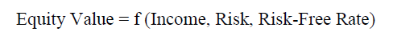

Income of an asset can be quantifiable in a few ways. The one we use here is the free cash flow (FCF) of the asset, which reflects the amount of cash a company can return to its shareholders after paying any operational expenses. The risk factor can be a function of the expectation or anticipation of how FCF will change in the future (TG). Finally, as a way to calibrate our model with the market, we take into consideration US Treasury Bills to represent the Risk Free Rate (RF) of the model. The result of these three factors give us the Firm Value (FV).

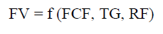

### 2.2 Proposed Model
Our model has three main components used to model firm value,  FCF, TG, and  RF. Each of these components can have varying degree of factors, but will be designed in a way that emulates the original paper by Wang1. The terms n are measured quarterly.  

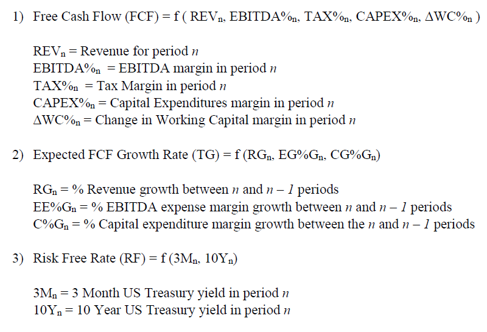

The three components in combination form the ten factors of the equilibrium valuation model. The way the factors are chosen is much of an art form. This is related to the bias-variance trade-off that needs to be taken into consideration. Our work here in choosing the factors are to replicate the work of the original model by Wang. The complete factor model is:

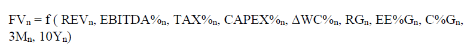

Firm Value (FV) itself is derived by a combination of factors including non-operating assets (which itself is part of derived calculations), and market capitalization. We include the formula below:

Here is a summary of the main fields we use in the model and their relation the generic Equilibrium model discussed in previous sections.

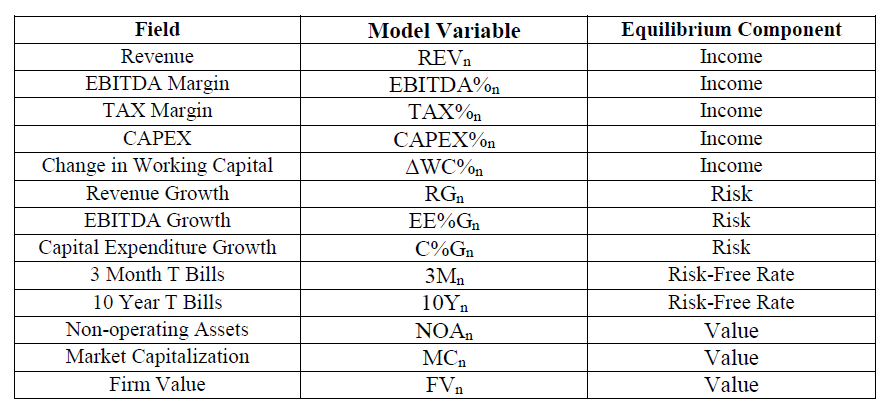

## 3. Literature Review
This paper is largely a continuation of the research done by Boris Wang in his paper Equilibrium Valuation Model: A Regression-Based Fundamental Equity Valuation Model. The main reason we chose to follow Wang’s design was because it was freely available, with intuitive research and diagrams that made it reproducible. The one area posed for improvement in his work is the explanation of how he designed the regression, and details of how the regression performed. Wang’s model makes lots of assumptions, which are present in our work as well. These assumptions are:

1. It’s a competitive market
2. No transaction costs
3. No restrictions on short-selling or borrowing
4. Investors seek to maximize economic returns
5. Investors are rational and risk-neutral
6. All assets are perfectly liquid
7. All information is available to all market participants simultaneously

## 4. Research Hypothesis
Our main objective in this paper is to build the equilibrium model presented by Wang and do a comprehensive analysis on the regression coefficients presented in the original paper. Our paper aims to answer two main questions:

1. How relevant are the proposed model features in determining a firm’s value?
2. Do these features provide useful insights through linear regression, and other types of regression?

## 5. Methods of Data Collection and Transformation
Our data pipeline consists of three stages. The first stage involves the raw data collection from Bloomberg to our local computers. The second stage involves a basic transformation and cleaning to extract only the relevant data required for the model. The third and final stage is for creating the model features to be used for analysis. The data cleaning operation performed in this section is done in Python (while our analysis in section 6 is done in R).

### 5.1 Data Collection
Two sources of data were required for this analysis, the first being fundamental data from large companies, and the second being US treasury yields from the US. The first was sourced from Bloomberg, while the yields were downloaded from the St. Louis Fed website3. The three financial statements of nine blue-chip stocks were collected including data spanning 38 years from as early as 1st quarter of 1990 (or the earliest available data), to the 3rd quarter of 2018, with a term structure of quarter frequency. This provides approximately 120 different points in time where the metrics of each company is analysed. Data obtained from Bloomberg4 had a constraint of 40 periods per download. The first sheet contains data from 1990-1998, the second 1998-2008, and final period is 2008-2018. The first transformation involves aggregating each of these three files into one dataset (for each company). For the equity data, Bloomberg provided excel files, each with five sheets pertaining to one of the main financial statements. Our first transformation was to extract the relevant columns and combine all data for one company in different .csv files for easy processing.

### 5.2 Data Cleaning Calculations
These calculations are required as the original research paper had them already extracted. These additional calculations were not included in the original paper, but needed to be done to match the data proposed in the model.

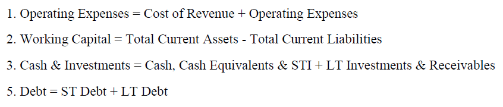

Each field also has an explicit variable name. These variable, while not seen when viewing the excel file, are necessary when extracting the data from a software program. The fields are included in the appendix.

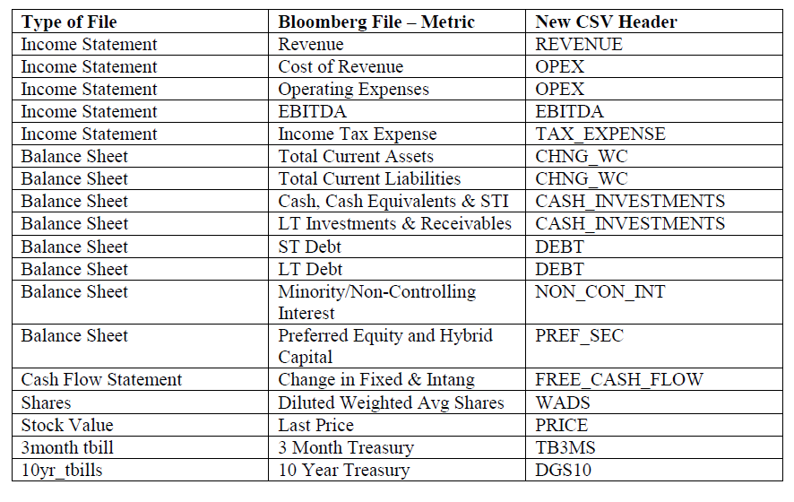

### 5.3 Creating Model Variables
These next calculations are organized separately because they are included in the original research paper by Wang. We followed his formula to be consistent. Before these calculations were done, we performed trailing twelve month transformation on each data column. For a given period n, it is calculated as the sum of (n – 1 + n – 2 + n – 3 quarters). This is help remove the seasonality of the data. For more information on how the data preparation for the features were done, it can be read in Wang’s paper1.

These transformations were done using a combination of Python and Pandas. After all the fields are extracted and placed in their respective .csv files we use another Python to create the model.csv file used in analysis for each company. Given the required effort for data cleaning, it is worth mentioning that our analysis is a small sample of the original paper’s universe for data analysis, and is not entirely representative. Now that the scripts are built however, it would easier to extract larger datasets for future analysis. The only manual process is download the files from Bloomberg. Also the original paper excluded financial sector and some other industries that had did unique types of financial reporting.

The model proposed is:

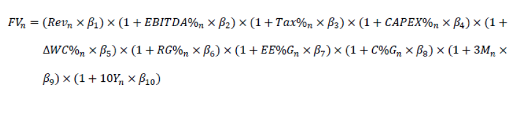

More detail on why these features are chosen can be reviewed in section 2.2. Here we describe how the value of each one of these features are determined. As previously stated, these are largely replicated to match the values done in Wang’s paper. Deviations from his formula are mentioned explicitly.

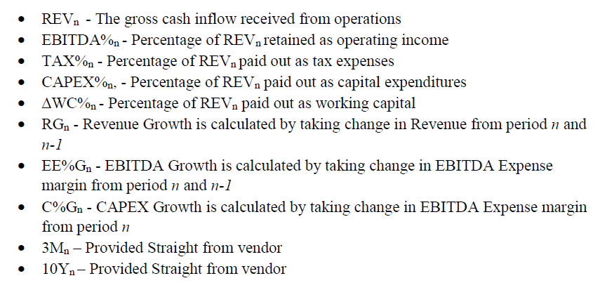

## 6. Analytic Methods
After the data cleaning and transformation we begin analysis on our nine companies. This is represented as a list of dataframes in R. The model features for each company is represented in its own dataframe for initial exploratory analysis.

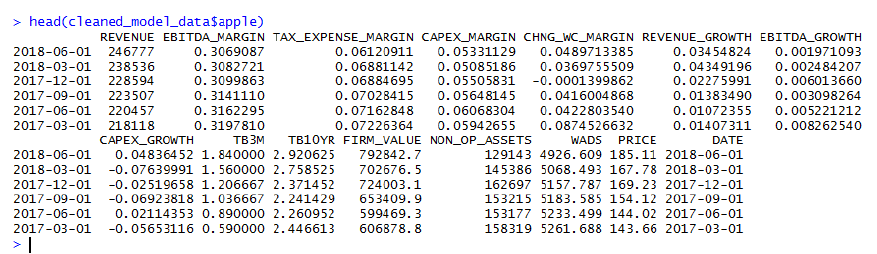

### 6.1 Outliers
First objective in our analysis was to consider the outliers of the dataset for each parameter of the model. A method was developed to plot each model feature for the nine companies, along with a method to plot all model features for one company. This way we can get a comprehensive view of our data by model feature, and by company. First a quick look at each feature visually will aid us in figuring out what outliers should be considered. We will take one sample company, Amazon.

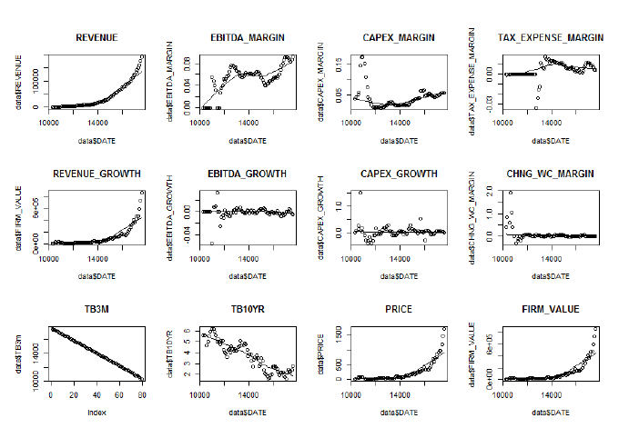

It is clear from the various scatterplots that some of our features do exhibit some outliers. Examples of some extreme outliers include the tax expense margin and change in working capital margin. In the next section we will take a look on how to handle these outliers. One thing to consider is perhaps we just had bad data on one of our companies. The next method used will extract the same feature for all nine companies and display it in a similar matter. This way we will be able to identify what features are more commonly prone to outliers instead of a single company. For comparing one feature for all companies, we provide two samples of features, revenue and Change in Working Capital Margin along with the intended predicted value (Firm Value). To see the graphs of all model features please the appendix.

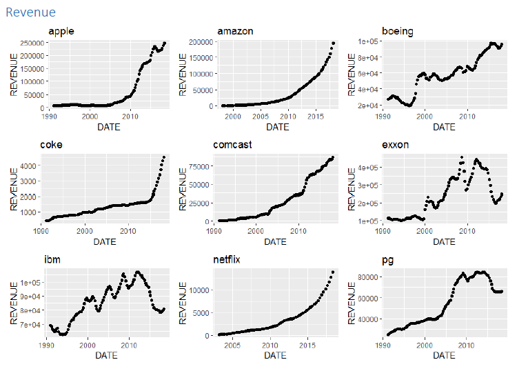

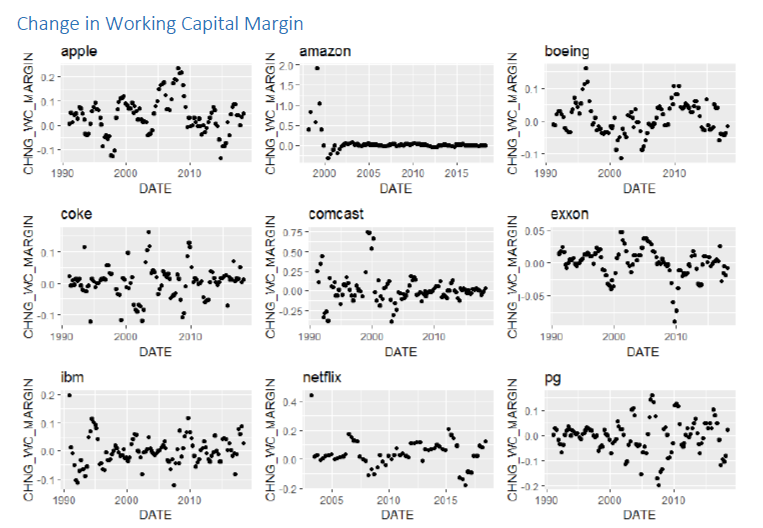

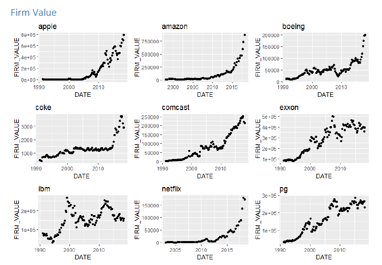

From the previous three graphs it is made quite clear that our data on revenue and calculated firm value is pretty solid, while our data on change in working capital is prone to some outliers (while being overall more volatile). After removing any outliers that are clearly just issues from egregious data, we have three options for handling outliers that actually impact the analysis of the regression. First, and the easiest option, is to simply ignore the outliers. The second option would be to remove any outliers, and the third is capping the outliers based on the 1st and 3rd quartile. First let us visualize how the data may change when removing outliers.

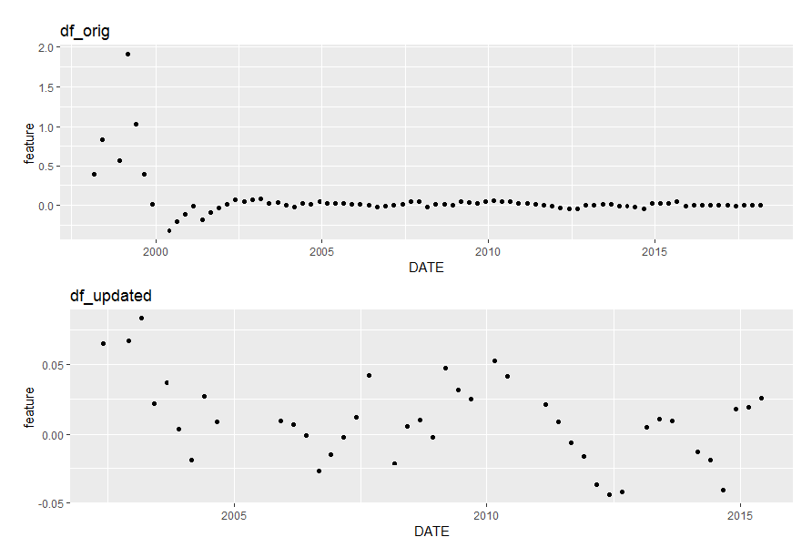

As you can see, the data is clearly transformed by removing the first few points. One thing to keep in mind is that outliers from all features are removed, not just this feature. So overall it means quite fewer data points. Our next method caps the outliers so they remain within the inter quartile range, as shown below.

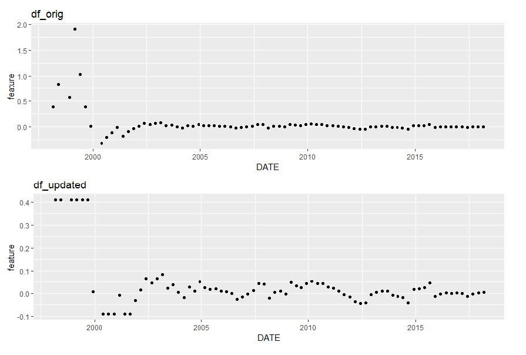

Moving forward, the regression done will use data from the capped outlier method. Usually the no-outlier case may be optimal, however given the lower number of data points we have decided the method that keeps more data for the model. After the outliers are cleaned, we transform our list of dataframes into one dataset. As the figure shows, we have 904 rows of data (about 100 samples per company) ranging from the 4th quarter in 1990 to the 2nd quarter in 2018.

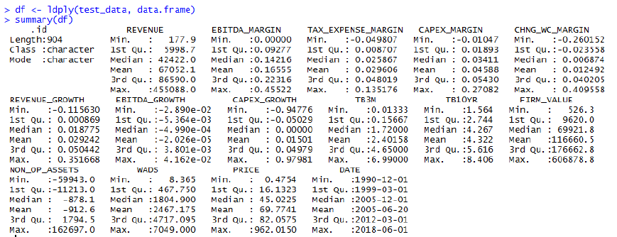

All data, from the original excel files provided from Bloomberg, to the .csv files generated from the data wrangling (and the scripts used to do it) are available on github.com/dano09.

## 7. Regression and Results
Our data is cleaned, and we have verified outliers. Now we are finally able to perform our analysis on the equilibrium valuation model. Wang’s original paper did not go into detail about what kind of regression he did. The information provided was that he used excel solver to minimize the MAPE error. Here we will explore a couple of models and review how well each feature performs and their relevance on prediction of firm value.

### Model 1: Linear Regression
Our first model is the standard linear regression in R. We use the linear model function and create the model using the features described in previous sections.

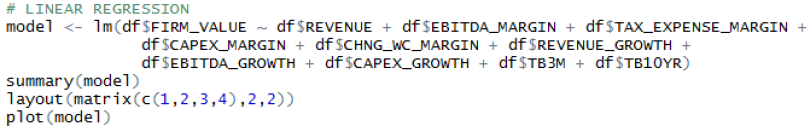

The code to run the model is simple to implement. Next we will look at the diagnostics and summary of variables from the model.

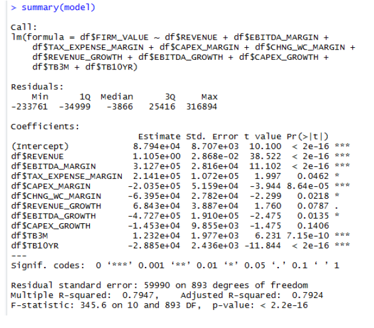

Revenue, EBITDA, CAPEX Margin seemed to be the most significant features for our initial analysis, along with the two risk-free rates. Looking particularly as the Multiple R-squared, and Adjusted R-square and seeing these values of approx. 79% give an impression that there is some correlation between our model and the firm value.
The Residuals

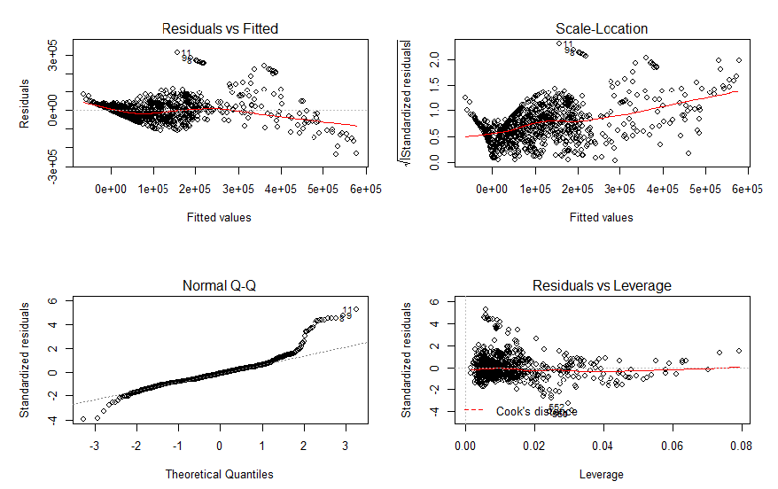

The Residuals vs Fitted chart sheds light on our underlying factors. It gives insight in that there may be a non-linear relationship between our predictor variables and the outcome
variable. The residuals shown from Normal Q-Q plot appear to behave linearly except towards the end of the distribution, it almost looks as if it follows some sort of Poisson process. Checking for Homoscedasticity, we view the Scale-Location graph. While somewhat linear, there is a clear pattern of the majority of the variance taking place early on followed by a dispersion. And since we already took care of the majority of our outliers, the Cook’s distance presented in the Residuals vs Leverage diagram does not provide much useful insight.

### Model 2: Ridge Regression
Our next three models will try to build out robust models using regularization5. For ridge regression, we check various regularization values (lambda) to identify the best fit. We will accomplish this by using the cross validation library in R. These models apply regularization terms to penalize models that have large numbers of coefficients. There are plenty of online resources for discovering the different implementation details of these models.

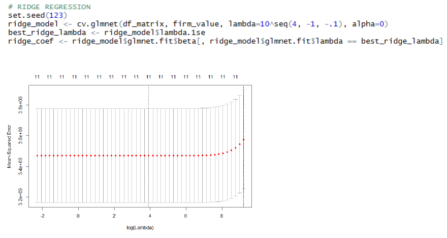

### Model 3: LASSO Regression

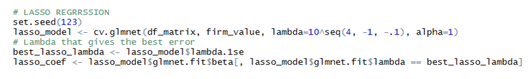

The graph below shows for LASSO lambda is best at around 4 and starts increase the error after it grows past 6.

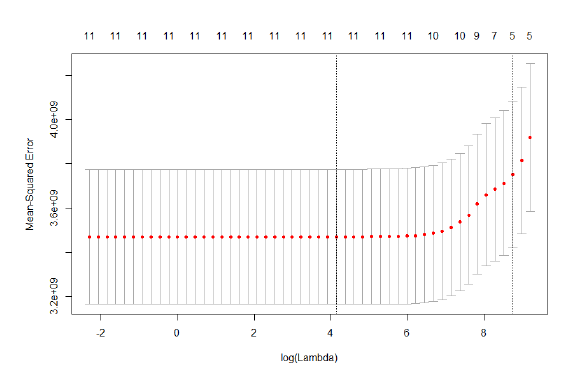

### Model 4: Elastic Net Regression
Finally we take a look at a combination of both L1 and L2 regularization which is called elastic net.

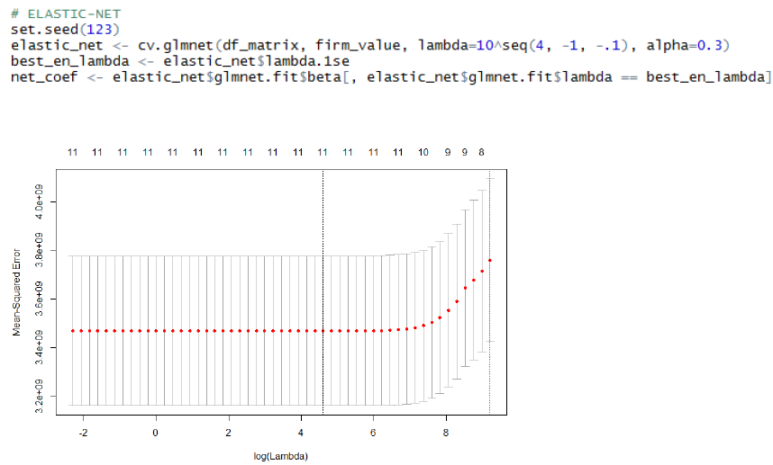

We will now compare the coefficient values for each of regularization models to determine which features are most useful for the equilibrium valuation model.

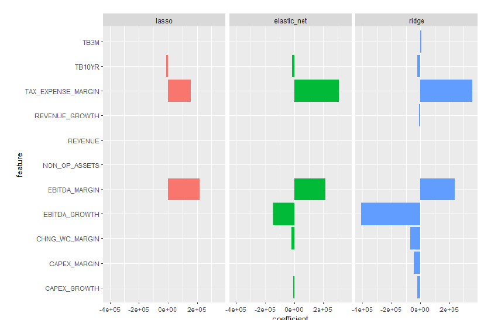

Here we get a snapshot showing how each model identifies features. Don’t let the size of coefficients throw you off, they are a function of the size of the feature. The important thing to note is while Ridge regression makes use of all features, Lasso regression only showed that the 10 year treasury yield, Tax Expense, and EBITDA margin are the most important factors. Elastic net does a combination of both models loss terms so it includes a few more. Let us break down each coefficient graph by their three main components, value, growth, and risk-free rate.

### Price Factors
For price factors, we see all factors being used except Revenue and Operating Assets for ridge regression. This may be because these two features are the only ones that are representative of actual value, not a margin calculation.

### Growth Factors
For growth factors, Ridge regression focuses on EBITDA growth, Elastic Net using the same, but with a lower weighting, and lasso completely removing all growth factors.

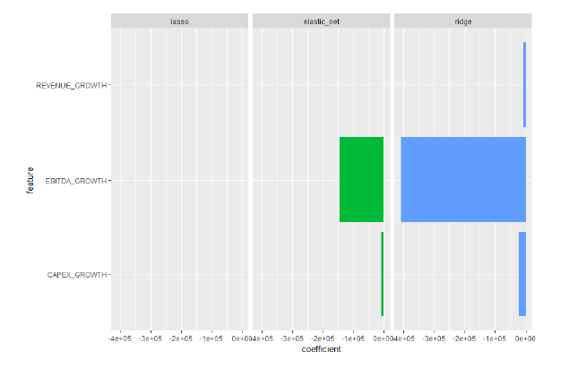

### Risk-Free Rate
It is clear that the 10 Year Treasury Rate has an impact on the equilibrium model. This comes almost obviously since most things in finance are price in relation to the risk free rate. The thing that is interesting is how much more the longer term horizon rate (10 Years) appeared relevant compared to the shorter term treasury yield.

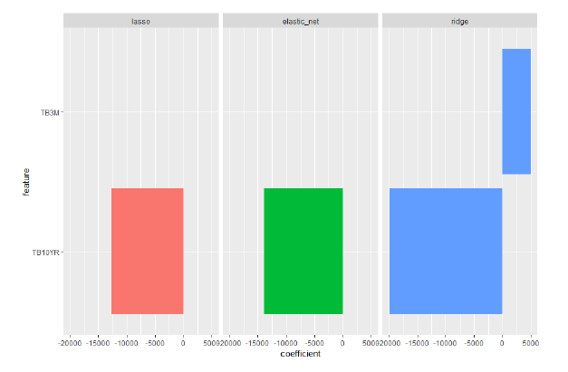

## Conclusion
Our analysis has taken a look at the equilibrium valuation model from Wang. From extracting the data to replicating the features and finally performing regression on the model. Our findings show that the model does have potential to be used in a predictive manner, and that some of the features may appear to have some potential to be indicators on the firm value. For determining the accuracy of this model, future work could be done to apply these models to test datasets of new financial statements.

## References
1. Equilibrium Valuation Mode: A Regression-Based Fundamental Equity Valuation Model
2. https://www.investopedia.com/terms/e/equilibrium.asp
3. https://www.stlouisfed.org/
4. Using FA (financial Analysis function)
5. https://www.youtube.com/watch?v=FWCPFUwZkn0

